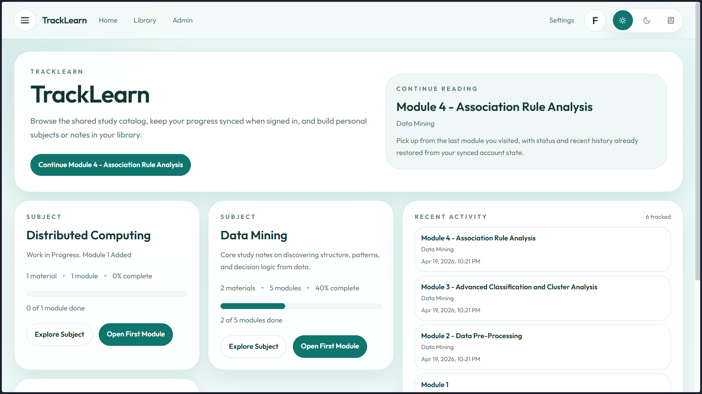
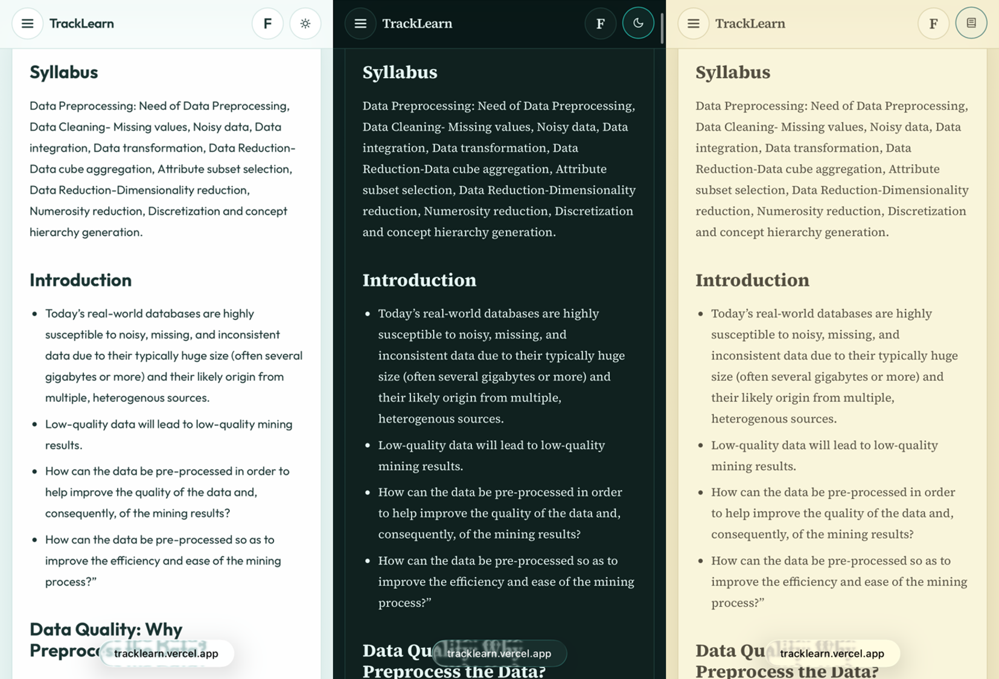

# TrackLearn

TrackLearn is a study platform for browsing learning content, tracking progress, and building your own private study library.

It supports two usage modes:

- Browse public study content without signing in
- Sign in to save progress, create private subjects and notes, and submit content for review

Currently hosted at [TrackLearn](https://tracklearn.vercel.app/)

## Overview

TrackLearn is designed around a shared learning library plus personal study space.

- Explore public subjects, modules, and materials
- Continue where you left off with recent activity and progress tracking
- Mark modules as done or flag them for revision
- Choose your reading theme and font
- Create your own personal subjects, modules, and materials
- Paste Markdown or upload `.md` files for personal content
- Submit personal content for publication review
- Review and moderate submissions from the admin dashboard

## Main Features

### Public learning experience

- Public library anyone can browse
- Subject overview pages for each topic
- Module and material pages with clean reading layouts
- Sidebar navigation for moving between subjects, modules, and materials
- Table of contents navigation for long Markdown pages

### Study tracking

- Recent activity on the home page
- Per-subject progress bars
- "Mark as Done" and "Flag Revision" actions on modules
- Guest progress saved in the browser
- Account sync for signed-in users

### Personal workspace

- Create private subjects
- Add private modules and materials
- Paste Markdown directly or upload Markdown files
- Keep personal work private until you are ready
- Submit content for review when you want it published

### Admin tools

- Review pending publication requests
- Approve, reject, or request changes
- Compare submitted updates with the current public version
- Edit or unpublish public content

## UI Overview

### Home dashboard

The home page gives users a quick starting point with subject cards, progress bars, recent activity, and a "Continue Reading" area.



### Public library

The library page is the main browsing area for public subjects. Signed-in users also see their personal subjects and a shortcut to the manage area.

### Study reader

Subject, module, and material pages are built for reading. Users can move through content with the sidebar, use the table of contents on longer pages, and track study progress from the module header.


#### Mobile View


### Personal workspace

The Manage page is where signed-in users create subjects, add entries, upload Markdown, and monitor publication requests.

### Settings and progress

The Settings page includes theme selection, font selection, import/export for progress, reset controls, and synced account state when logged in.

### Admin dashboard

Admins can review submissions, inspect snapshots, edit public entries, and manage the public catalog from one place.


## Access levels

TrackLearn expands in three layers of access. Each level includes the capabilities of the previous one.

### Guest

Available without authentication:

- Public content browsing
- Subject and module reading
- Local progress tracking
- Theme and font preferences

### Signed in as User

Unlocks the following features:

- Synced progress and preferences
- Personal subject creation
- Personal module and material creation
- Markdown paste and `.md` upload for personal entries
- Publication request workflow

### Signed in as Admin

Allows the following:

- Admin dashboard access
- Publication review and moderation
- Public catalog editing and unpublishing tools

## Setup

### Local run (basic setup)

1. Install [Node.js LTS](https://nodejs.org/).
2. Install dependencies:

```bash
npm install
```

3. Start the app:

```bash
npm run dev
```

4. Open [http://localhost:3000](http://localhost:3000)

The app will still load public study content from `data/subjects` even if MongoDB is not configured.

### Full application setup

This configuration enables authentication, personal content management, moderation, and synced progress.

#### Requirements

- Node.js LTS
- A MongoDB Atlas database
- A Google OAuth app

#### Step 1: Install dependencies

```bash
npm install
```

#### Step 2: Configure environment variables

Create a file named `.env.local` in the project root and copy the values from `.env.example`.

Example:

```env
MONGODB_URI=
MONGODB_DB=tracklearn
AUTH_SECRET=
AUTH_GOOGLE_ID=
AUTH_GOOGLE_SECRET=
BETTER_AUTH_URL=http://localhost:3000
```

Notes:

- `AUTH_SECRET` should be a long random string
- `BETTER_AUTH_URL` should stay `http://localhost:3000` for local development
- `MONGODB_DB` can stay as `tracklearn` unless you want a different database name

To generate an auth secret:

```bash
node -e "console.log(require('crypto').randomBytes(32).toString('hex'))"
```

#### Step 3: Seed the catalog

```bash
npm run seed:mongodb
```

This imports the public subjects, modules, and materials from `data/subjects` into MongoDB.

#### Step 4: Run the app

```bash
npm run dev
```

Then open [http://localhost:3000](http://localhost:3000)

## Application Flow

### Guest mode

1. Open the home page
2. Browse subjects from the library
3. Read modules and materials
4. Track progress locally in the browser

### Authenticated users

1. Open `/login`
2. Choose a role
3. Sign in with Google
4. Go to Library or Manage
5. Create personal subjects and entries
6. Submit content for review when ready

### Admin mode

1. Sign in as admin
2. Open `/admin`
3. Review pending publication requests
4. Approve, reject, edit, or unpublish content


## Tech Stack

TrackLearn is built with:

- Next.js
- React
- TypeScript
- Tailwind CSS
- Framer Motion
- Better Auth
- MongoDB

## Notes

- This project supports guest mode and signed-in mode
- Public content can come from MongoDB or from the local `data/subjects` fallback
- The current login flow includes role selection for evaluation and testing purposes
